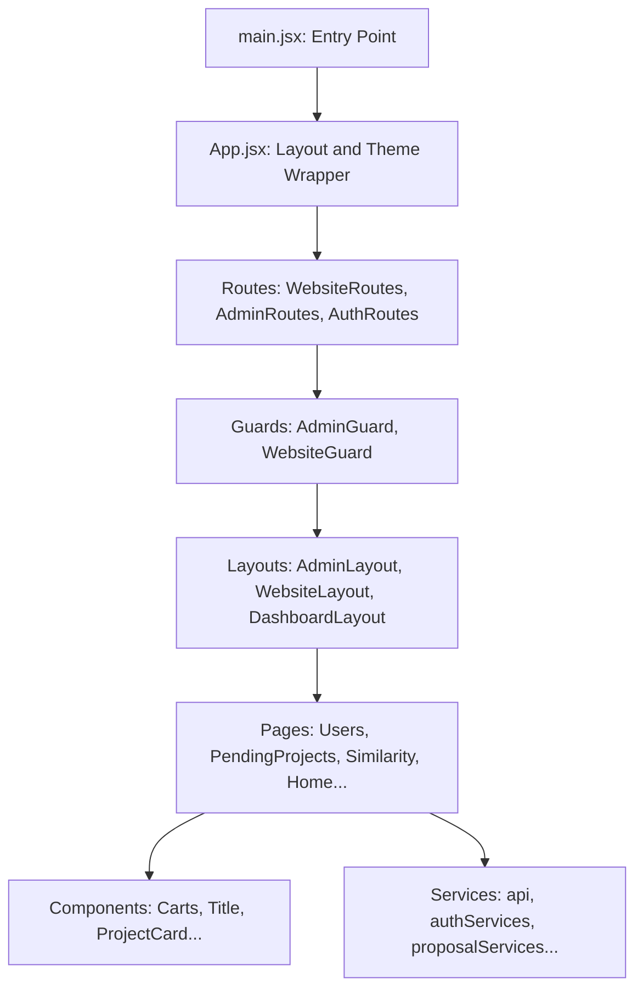

# React & "Evaluate It Easily" Project Walkthrough
> A complete, beginner-friendly guide to mastering React basics and understanding this project's code for your interview.

---

## 💡 Part 1: React Basics (The 101 for Beginners)

If you are coming from traditional HTML/CSS/JS or PHP development, React introduces a few core shifts in how web applications are built. Here are the fundamental concepts:

### 1. Component-Based Architecture
In traditional development, you build a single large page. In React, everything is a **Component**—a self-contained building block that controls a piece of the user interface (UI).
- Components look like custom HTML tags. For example, `<Title />` or `<Carts />`.
- Functional components are just normal JavaScript functions that return JSX.
- By breaking the UI into components, you can write code once and reuse it anywhere.

### 2. JSX (JavaScript XML)
JSX is a syntax extension that allows you to write HTML-like elements directly inside your JavaScript code.
- Instead of using `document.createElement` or template strings, you write `<div className="container">Hello World</div>`.
- **Dynamic expressions**: You can insert any JavaScript expression (variables, functions, math) inside JSX using curly braces `{}`. For example: `<p>Total count: {proposals.length}</p>`.
- *Note:* In HTML you use `class`, but in JSX you must use `className` because `class` is a reserved keyword in JavaScript.

### 3. Props (Properties)
Props are the way components talk to each other. They allow a parent component to pass data down to a child component.
- Props are **read-only** (immutable). The child component cannot change the props it receives.
- **Example**: In your code, the parent page `<PendingProjects />` passes count statistics to the `<Carts />` component:
  ```jsx
  <Carts 
      acceptedCount={acceptedCount} 
      rejectedCount={rejectedCount} 
      totalCount={proposals.length} 
  />
  ```

### 4. State (`useState`)
If props are like inputs passed to a component, **State** is the component's private, internal memory.
- State is used to store data that changes over time (like input fields, toggle switches, or data fetched from a server).
- When a component's state changes, React automatically re-renders that component and its children to show the updated data on the screen.
- **Example**:
  ```jsx
  import { useState } from "react";

  const [loading, setLoading] = useState(true);
  // 'loading' is the current state value
  // 'setLoading' is the function used to change that state value
  ```

### 5. Effects (`useEffect`)
`useEffect` is a React Hook that lets you synchronize a component with an external system (such as fetching data from an API, setting up timers, or listening to scroll events).
- It takes two arguments: a **callback function** containing the side-effect code, and a **dependency array**.
  - **`[]` (Empty array)**: Runs the code **only once** when the component first appears on the screen (mounts). Ideal for data fetching on load.
  - **`[dependency]`**: Runs the code when the component mounts AND whenever the `dependency` value changes.
  - **Cleanup**: If you return a function from `useEffect`, React runs it when the component is removed from the screen (unmounts) to prevent memory leaks (e.g., clearing intervals).
- **Example**:
  ```jsx
  useEffect(() => {
      console.log("This component has loaded!");
  }, []); // empty dependencies = runs once
  ```

### 6. The Virtual DOM
In traditional Javascript, modifying the DOM (`document.getElementById().innerHTML = ...`) is slow because the browser has to recalculate styles, layout, and repaint the screen.
- React keeps a lightweight, virtual representation of the DOM in memory (the **Virtual DOM**).
- When state changes, React updates the Virtual DOM first, compares it with the previous state (called **diffing**), finds the exact minimal changes needed, and updates only those specific parts in the real browser DOM. This makes React incredibly fast.

### 7. React Router (`react-router-dom`)
React projects are usually Single Page Applications (SPAs). This means the browser downloads only one HTML file (`index.html`). 
- When a user clicks a link, the page does **not** reload. Instead, **React Router** intercepts the click, updates the URL bar, and swaps out which components are shown on the screen.
- Key concepts:
  - `<Routes>` and `<Route>` define paths and what component to render.
  - `<Outlet />` is a placeholder that renders the child routes of a parent route (used to create common layouts with sidebars/headers).
  - `useNavigate()` is a hook that lets you programmatically navigate the user (e.g., `navigate("/auth")` after logging out).

---

## 🏗️ Part 2: Architecture of "Evaluate It Easily"

Here is how the files and directories in your workspace (`evaluate-it-easily`) fit together:



### Key Folders Explained:

1. **`src/main.jsx`**
   - The absolute entry point of the app. It binds the React application to the `<div id="root">` element inside `index.html` and wraps the app in `<BrowserRouter>` to enable routing.

2. **`src/App.jsx`**
   - The main app component. It configures the global styling/reset (`<CssBaseline />`), setup for Material-UI Theme (`<ThemeProvider>`), routing files, and global Toast notifications (`<ToastContainer />`).

3. **`src/routes/`**
   - Defines the URL paths.
   - **`AdminRoutes.jsx`**: Paths prefixed with `/admin` for administrators.
   - **`WebsiteRoutes.jsx`**: Paths for general users and student dashboard options.
   - **`AuthRoutes.jsx`**: Login and registration paths.

4. **`src/guards/`**
   - **Route Guards** prevent unauthorized access.
   - For instance, `AdminGuard.jsx` reads the user role and JWT token from local storage. If they are not logged in or are not an `"Admin"`, they are redirected away.

5. **`src/layouts/`**
   - Shared structural wrappers. Instead of copying and pasting the Sidebar and Navbar code onto every page, pages are rendered inside layouts (using the `<Outlet />` element).

6. **`src/pages/`**
   - Page-level components (e.g., `Home.jsx`, `PendingProjects.jsx`, `Users.jsx`). They are responsible for retrieving data from services and passing it down to presentation components.

7. **`src/components/`**
   - Small, reusable UI elements. For example, `Carts.jsx` takes raw numbers and renders interactive status cards, while `Title.jsx` shows section headers.

8. **`src/services/`**
   - **`api.jsx`**: Handles central HTTP configuration using Axios, pointing to the backend hosted at `https://evaluateiteasily.runasp.net`.
   - **`authServices.jsx`**: Manages logging in, logging out, checking roles, and local storage token management.
   - Other files like `proposalServices.jsx` handle specific API endpoints (e.g., fetching, approving, or rejecting proposals).

---

## 🔍 Part 3: Deep Dive Code Walkthroughs

Let's dissect exactly how React concepts are applied in three key files from your project.

### 1. The Page Component: `src/pages/admin/PendingProjects.jsx`
This page displays graduation projects awaiting review.

```jsx
export default function PendingProjects() {
    // 1. STATE DEFINITION
    const [pendingProjects, setPendingProjects] = useState([]);
    const [loading, setLoading] = useState(true);
    const [proposals, setProposals] = useState([]);
    const [acceptedCount, setAcceptedCount] = useState(0);
    const [rejectedCount, setRejectedCount] = useState(0);
    const [pendingCount, setPendingCount] = useState(0);

    // Helper function to count statuses
    const countProposalStatuses = (proposals) => {
        let accepted = 0; let rejected = 0; let pending = 0;
        proposals.forEach((proposal) => {
            if (proposal.status === "Accepted") accepted++;
            else if (proposal.status === "Rejected") rejected++;
            else if (proposal.status === "UnderReview") pending++;
        });
        setAcceptedCount(accepted);
        setRejectedCount(rejected);
        setPendingCount(pending);
    };

    // 2. EFFECT: Fetching data on component mount
    useEffect(() => {
        const fetchProjects = async () => {
            try {
                // Call API service
                const projects = await getProposals(); 
                countProposalStatuses(projects);
                setProposals(projects);
                // Filter only 'Pending' ones to show in list
                setPendingProjects(projects.filter((proposal) => proposal.status === "Pending"));
            } catch (error) {
                HandleErrors(error.errors);
            } finally {
                // Done fetching, hide loader
                setLoading(false); 
            }
        };
        fetchProjects();
    }, []); // Empty array means this runs ONLY ONCE when page opens.

    // 3. CONDITIONAL RENDERING
    if (loading) return <Loader />; // Show loading animation if still loading

    return (
        <div className="relative">
            <Title title={"Pending Projects"} />
            {/* 4. PASSING PROPS TO CHILD COMPONENT */}
            <Carts
                acceptedCount={acceptedCount}
                rejectedCount={rejectedCount}
                pendingCount={pendingCount}
                totalCount={proposals.length}
            />
            <div className='w-full lg:pr-4 px-3 lg:px-0'>
                {/* 5. TERNARY RENDERING: Show message or list */}
                {!pendingProjects.length ? (
                    <LottieFiles name={"animatedData2"} />
                ) : (
                    <div className="mt-5">
                        <SubmissionsPage data={pendingProjects} />
                    </div>
                )}
            </div>
        </div>
    );
}
```

#### Why this is great for an interview:
- Demonstrates **data fetching on mount** via `useEffect`.
- Demonstrates **state management** for server data (`proposals`, `pendingProjects`) and UI states (`loading`).
- Demonstrates **reusability**: it delegates visual components to `<Title />`, `<Carts />`, and `<SubmissionsPage />`.
- Demonstrates **conditional rendering**: using ternary operators `condition ? true : false` and `if (loading)` to handle loading and empty states cleanly.

---

### 2. The Reusable Component: `src/components/admin/Carts.jsx`
This component displays three cards showing Accepted, Rejected, and Pending counts with count-up animations.

```jsx
export default function Carts({ acceptedCount, rejectedCount, pendingCount, totalCount }) {
    // 1. RECEIVING PROPS (Destructured in parameter list)
    const theme = useTheme();
    const colors = tokens(theme.palette.mode);

    // Calculate percentage rates
    let acceptedPercentage = totalCount === 0 ? 0 : Math.round((acceptedCount / totalCount) * 100);
    let rejectedPercentage = totalCount === 0 ? 0 : Math.round((rejectedCount / totalCount) * 100);
    let pendingPercentage = totalCount === 0 ? 0 : Math.round((pendingCount / totalCount) * 100);

    // 2. INTERNAL STATE: Used for the count-up visual animations
    const [acceptedProjects, setAcceptedProjects] = useState(0);
    const [rejectedProjects, setRejectedProjects] = useState(0);
    const [similarProjects, setSimilarProjects] = useState(0);

    // Helper function to animate numbers counting up
    const handleProjects = (setState, targetValue) => {
        let interval = setInterval(() => {
            setState((prev) => {
                if (prev >= targetValue) {
                    clearInterval(interval);
                    return targetValue;
                }
                return prev + 1;
            });
        }, 50);
        return () => clearInterval(interval); // Return cleanup function
    };

    // 3. EFFECT: Starts count-up animation whenever percentage numbers recalculate
    useEffect(() => {
        const cleanupAccepted = handleProjects(setAcceptedProjects, acceptedPercentage);
        const cleanupRejected = handleProjects(setRejectedProjects, rejectedPercentage);
        const cleanupPending = handleProjects(setSimilarProjects, pendingPercentage);

        window.scrollTo(0, 0);

        // Clean up intervals if component unmounts or percentages change
        return () => {
            cleanupAccepted();
            cleanupRejected();
            cleanupPending();
        };
    }, [acceptedPercentage, rejectedPercentage, pendingPercentage]); // Re-runs if these change

    return (
        <div className="relative grid grid-cols-12 px-2 carts overflow-hidden gap-3">
            {/* Example of one Cart Card (Accepted Projects) */}
            <div className="col-span-12 sm:col-span-6 lg:col-span-4">
                <div className="border-0 flex h-40 justify-center items-center rounded-lg p-3 shadow"
                     style={{ backgroundColor: colors.blueAccent[800] }}>
                    {/* Visual UI Layout code using Material UI colors */}
                    <p className="m-0 text-[var(--primary-color)] mt-2">Accepted Projects</p>
                    <p className="mt-4 text-xl text-[#00e676]">{acceptedProjects}%</p>
                </div>
            </div>
            {/* ... Other cards ... */}
        </div>
    );
}
```

#### Why this is great for an interview:
- Shows how to write **custom visual effects** inside `useEffect` (using `setInterval`).
- Illustrates the critical **Cleanup Function** in `useEffect`. If you don't call `clearInterval`, the timer will keep running in the background forever, causing a memory leak.
- Demonstrates **Prop usage**: it doesn't fetch data itself; it just renders whatever counts it is given by its parent.

---

### 3. The API and Authentication Layer: `src/services/api.jsx` & `authServices.jsx`
Your project handles security using JSON Web Tokens (JWT) and automatic refresh tokens.

#### The Request Interceptor (`api.jsx`):
Before any HTTP request goes to the server, this code intercepts it and adds the JWT bearer token:
```javascript
api.interceptors.request.use(
    (config) => {
        const token = localStorage.getItem("token");
        if (token) {
            config.headers["Authorization"] = `Bearer ${token}`;
        }
        if (!(config.data instanceof FormData)) {
            config.headers["Content-Type"] = "application/json";
        }
        return config;
    },
    (error) => Promise.reject(error)
);
```

#### The Response Interceptor & Refresh-Token Logic (`api.jsx`):
If the token expires, the server returns a `401 Unauthorized` status. The response interceptor intercepts this error, halts incoming API requests, contacts the `/Auth/refresh-token` endpoint to get a fresh token, saves it, and then completes the original failed request:
```javascript
api.interceptors.response.use(
    (response) => response,
    async (error) => {
        const originalRequest = error.config;

        // If server returns 401 (Unauthorized) and we haven't already retried
        if (error.response.status === 401 && !originalRequest._retry) {
            originalRequest._retry = true;
            isRefreshing = true;

            try {
                const refreshToken = getRefreshToken("refreshToken");
                if (!refreshToken) {
                    logout();
                    navigateTo("/auth");
                    return Promise.reject(error);
                }

                // Request a new access token
                const res = await axios.post(
                    "https://evaluateiteasily.runasp.net/Auth/refresh-token",
                    { refreshToken }
                );

                const newToken = res.data.accessToken;
                const newRefreshToken = res.data.refreshToken;

                // Store new tokens in LocalStorage
                setAuth(newToken, localStorage.getItem("userRole"), newRefreshToken);

                // Update default headers and retry original request
                api.defaults.headers.common["Authorization"] = `Bearer ${newToken}`;
                originalRequest.headers["Authorization"] = `Bearer ${newToken}`;
                return api(originalRequest);

            } catch (refreshError) {
                logout();
                navigateTo("/auth");
                return Promise.reject(refreshError);
            }
        }
        return Promise.reject(error);
    }
);
```

#### Why this is great for an interview:
- Explains how you handle **Security and Session Persistence** production-style.
- Demonstrates advanced Axios capabilities: **Interceptors** to handle authentication tokens silently in the background, keeping code DRY (Don't Repeat Yourself) since pages don't need to manually inject headers.

---

## 🎯 Part 4: High-Yield Interview Q&A

Study these questions carefully! They are highly likely to come up during your interview:

### Q1: What is the difference between state and props in React?
* **State** is the internal data storage of a component. It is private, owned by the component itself, and can be changed by calling its setter function (e.g., `setLoading()`). Changes in state trigger a component re-render.
* **Props** are properties passed from a parent component down to a child component (like attributes on an HTML element). They are read-only to the child component. If a parent updates its state and passes that state down as a prop, the child will re-render with the new value.

### Q2: What is the purpose of the dependency array in `useEffect`?
* The dependency array tells React when to run the hook's callback function.
  * If it's **empty `[]`**, the effect runs once when the component mounts.
  * If it contains **variables `[count, status]`**, the effect runs on mount and whenever any of those variables change.
  * If there is **no array at all**, the effect runs on *every single render* of the component (usually undesirable).

### Q3: Why do we need the clean-up function in `useEffect`?
* When you set up subscriptions, event listeners, or timers (like `setInterval` in your `Carts.jsx` component), they run in the browser environment. If the user navigates to a different page and the component is destroyed (unmounted), the timers will continue running, consuming memory and causing potential bugs. The cleanup function deletes these timers and listeners.

### Q4: How does navigation work in a React application?
* We use a client-side router library, in this case, `react-router-dom`. It intercept clicks on link elements, changes the URL in the browser address bar using the HTML5 History API (without reloading the page), and swaps out the active React components on the screen.

### Q5: How did you implement authentication and authorization in this project?
* **Authentication**: Users log in, and the server returns a JWT access token and a refresh token. These are stored securely in `localStorage`.
* **Authorization**:
  * We use an Axios request interceptor to automatically attach the JWT token as a `Bearer` authorization header to all outgoing server requests.
  * We protect routes using **Route Guards** (e.g., `AdminGuard.jsx`). If a user tries to access `/admin` paths but lacks the `"Admin"` role in local storage or doesn't have a token, the guard intercepts them and redirects them to the login screen.
  * If the access token expires (resulting in a `401` error), an Axios response interceptor uses the refresh token to get a new access token in the background, saving the user session without forcing a re-login.

### Q6: What is a React Hook? Can you name some?
* Hooks are built-in functions that let functional components use state and other React features (like lifecycle methods).
* Examples:
  * `useState`: Manages local component state.
  * `useEffect`: Handles side effects (data fetching, timers).
  * `useTheme` / `useContext`: Reads values from global React contexts (like the styling theme).
  * `useNavigate`: Programmatically redirects the user.
* Rules of Hooks: They must only be called at the very top level of a component (never inside loops, conditions, or nested functions), and only from React functional components.

### Q7: Why do we use a key prop when rendering lists in React?
* React uses the `key` prop to identify which items in a list have changed, been added, or been removed. It acts as a unique ID so React does not have to rebuild the entire DOM list from scratch when only one item changes, ensuring optimal rendering performance.

---

*Good luck with your interview! You've got this!*
